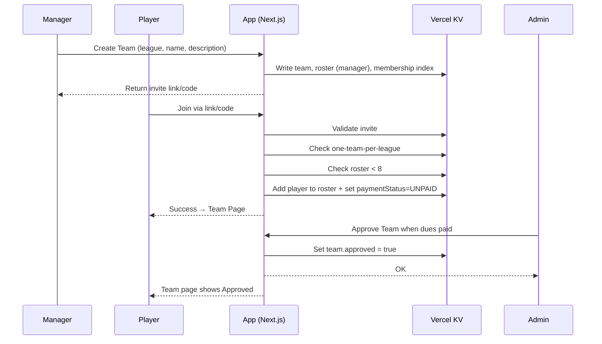

## High-Level Flows
```mermaid
flowchart TD

%% Public
A[Public (Not Logged In)] --> B[View Leagues]
B --> B1[See Teams (names + descriptions)]
B --> B2[See League Schedule (PDFs)]
B --> B3[See Standings/Bracket/Scores (placeholder)]
A --> C[Log In]

%% Player
C --> D[Player (Logged In)]
D --> D1[List of Teams (manager teams visually distinct)]
D --> D2[Create Team]
D --> D3[Join Team]
D --> D4[Click Team → Team Page]
D4 --> D4a[Team Name & Description (editable if manager)]
D4 --> D4b[Approval Status (set by Admin)]
D4 --> D4c[Team Roster (manager can invite)]
D4 --> D4d[Upcoming Schedule (team-only)]
D4 --> D4e[Current Standing & Game History]

%% Admin
C --> E[Admin (Logged In)]
E --> E1[List of Leagues They Manage]
E1 --> E2[Click League → League Dashboard]
E2 --> E2a[View All Teams in League]
E2 --> E2b[Update League Schedule → Auto-updates Teams]
E2 --> E2c[Update Standings / Game Results → Auto-updates Teams]
E2 --> E2d[Master Roster View]
E2d --> E2d1[Players + Team Name + Manager Star]
E2d --> E2d2[Click Player → Profile (contact, teams, payment)]
E2 --> E3[Click Team → Team Page (with admin extras)]
E3 --> E3a[Toggle Approved/Unapproved State]
E3 --> E3b[Click Player → Player Profile]

%% Super Admin
C --> F[Super Admin (Logged In)]
F --> F1[View All Leagues]
F1 --> F2[Click League → See League Manager + All Teams]
F2 --> F3[Click Team → See All Players]
```

---

## Roles and Actions
```mermaid
flowchart LR
  %% Lanes are subgraphs (swimlanes). Flow is left-to-right.
  %% Cross-lane arrows show handoffs or data dependencies.

  %% ===== Public Lane =====
  subgraph L1[Public (Not Logged In)]
    direction TB
    P1[Open App]
    P2[View Leagues]
    P3[View League → Teams (names/descriptions only)]
    P4[View League Schedule (PDFs)]
    P5[View Standings/Bracket/Scores (placeholder)]
    P6[Log In Prompt: "To create or join a team, or to see your current teams, please log in."]
    P7[Log In]
    P1 --> P2 --> P3
    P3 --> P4 --> P5
    P5 --> P6 --> P7
  end

  %% ===== Player Lane =====
  subgraph L2[Player (Logged In)]
    direction TB
    PL1[Dashboard: List My Teams\n(manager teams visually distinct)]
    PL2[Create Team]
    PL3[Join Team (Invite Link/Code)]
    PL4[Open Team Page]
    PL4a[Team Name & Description\n(editable if Manager)]
    PL4b[Approval Status (Admin-controlled)]
    PL4c[Roster (Manager can invite)]
    PL4d[Upcoming Schedule (Team-only)]
    PL4e[Current Standing & Game History]
    PL1 --> PL2
    PL1 --> PL3
    PL1 --> PL4
    PL4 --> PL4a --> PL4b --> PL4c --> PL4d --> PL4e
  end

  %% ===== Admin Lane =====
  subgraph L3[Admin (Logged In)]
    direction TB
    AD1[Dashboard: Leagues I Manage]
    AD2[Open League Dashboard]
    AD2a[View All Teams in League]
    AD2b[Update League Schedule (PDF)]
    AD2c[Update Standings / Input Game Results]
    AD2d[Master Roster View]
    AD2d1[Players + Team + Manager ⭐ + Payment Status]
    AD2d2[Click Player → Profile\n(contact, teams, payment)]
    AD3[Open Team Page (Admin View)]
    AD3a[Toggle Team Approved/Unapproved]
    AD3b[Click Player → Profile]
    AD1 --> AD2
    AD2 --> AD2a
    AD2 --> AD2b
    AD2 --> AD2c
    AD2 --> AD2d --> AD2d1 --> AD2d2
    AD2 --> AD3 --> AD3a
    AD3 --> AD3b
  end

  %% ===== Super Admin Lane =====
  subgraph L4[Super Admin (Logged In)]
    direction TB
    SA1[Dashboard: All Leagues]
    SA2[Open League → See League Manager + All Teams]
    SA3[Open Team → See All Players]
    SA1 --> SA2 --> SA3
  end

  %% ===== Cross-Lane Dependencies / Handoffs =====
  %% Public → Player
  P7 -.successful auth.-> PL1

  %% Player → Admin (approval & dues)
  PL4b -.approval status depends on admin action.-> AD3a

  %% Admin schedule/standings updates → Player team pages
  AD2b -.auto-updates team pages.-> PL4d
  AD2c -.auto-updates team pages.-> PL4e

  %% Admin roster/profile inspection ↔ Player data
  AD2d1 -.reads from.-> PL4c
  AD3b -.views.-> PL4c
```

---

## Registration Flow
```mermaid
flowchart TD
  %% Entry points
  A[Player logs in (Firebase)] --> B{Has a team in this league?}
  B -- No --> C[Choose: Create Team or Join Team]

  %% Create Team
  C -- Create Team --> CT1[Select league]
  CT1 --> CT2[Enter team name & description]
  CT2 --> CT3[Create team]
  CT3 --> CT4[Set managerUserId = current user]
  CT4 --> CT5[Add manager to roster (isManager=true)]
  CT5 --> CT6[Show: Invite Link / Join Code]
  CT6 --> D[Team Page (Manager view)]

  %% Join Team (Invite)
  C -- Join Team --> J1[Enter code or open invite link]
  J1 --> J2{Validate invite}
  J2 -- Invalid/Expired --> JErr1[Error: invalid/expired]
  J2 -- Valid --> J3{One-team-per-league?}
  J3 -- Already on a team --> JErr2[Error: already on a team]
  J3 -- OK --> J4{Roster size < 8?}
  J4 -- Full --> JErr3[Error: team is full]
  J4 -- OK --> J5[Add player to roster (isManager=false)]
  J5 --> J6[Set membership paymentStatus=UNPAID]
  J6 --> D

  %% Team Page
  D --> D1[Team name & description\n(editable only by manager)]
  D --> D2[Approval status (Admin-controlled)]
  D --> D3[Roster (manager can generate invites)]
  D --> D4[Upcoming team schedule]
  D --> D5[Current standing & game history]

  %% Admin Actions
  AD[Admin Dashboard] --> AD1[Open League]
  AD1 --> AD2[View Teams]
  AD2 --> AD3[Approve team when all dues are paid]
  AD1 --> AD4[Upload/Update League Schedule (PDF)]
  AD1 --> AD5[Input Game Results / Update Standings]
  AD3 -. toggles .-> D2
  AD4 -. auto-updates .-> D4
  AD5 -. auto-updates .-> D5
```

---

# Minimal Join Flow

